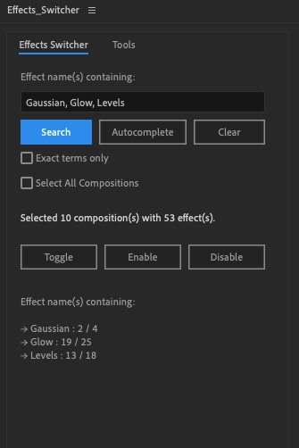

# ae-effects-switcher
A simple Effects Switcher ScriptUI for After Effects



You can search for effects in multiple compositions and enable (or disable) them.

## Installation

### After Effects:
Download [Effects_Switcher.jsx](./Effects_Switcher.jsx) and run installation in After Effects:

```
Files / Scripts / Install ScriptUI Panel...
```

`Restart` After Effects.

The script should be visible in `Window` tab.
